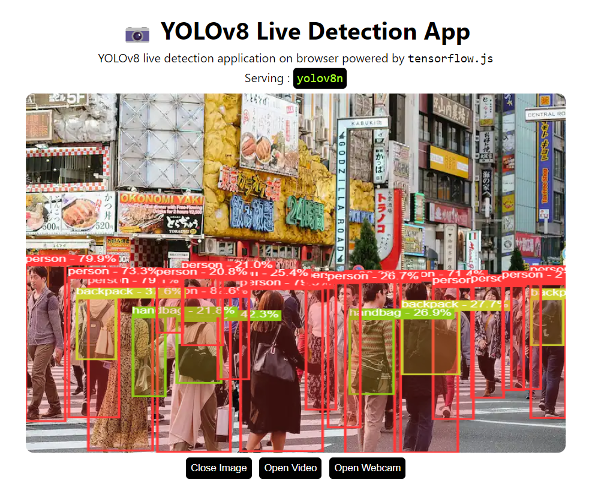

# Object Detection using YOLOv8 and Tensorflow.js

<p align="center">
  
</p>


---

Object Detection application right in your browser. Serving YOLOv8 in browser using tensorflow.js
with `webgl` backend.

**Setup**

```bash
git clone https://github.com/furious-error/spd_web.git
cd spd_web
npm i #Install dependencies
```

**Scripts**

```bash
npm start # Start dev server
npm build # Build for productions
```

## Model

YOLOv8n model converted to tensorflow.js.

```
used model : yolov8n
size       : 13 Mb
```

**Use another model**

Use another YOLOv8 model.

1. Export YOLOv8 model to tfjs format. Read more on the [official documentation](https://docs.ultralytics.com/tasks/detection/#export)

   ```python
   from ultralytics import YOLO

   # Load a model
   model = YOLO("spd.pt")  # load an official model

   # Export the model
   model.export(format="tfjs")
   ```

2. Copy `spd*_web_model` to `./public`
3. Update `modelName` in `App.jsx` to new model name
   ```jsx
   ...
   // model configs
   const modelName = "spd*"; // change to new model name
   ...
   ```
4. Done! 😊

**Note: Custom Trained YOLOv8 Models**

Please update `src/utils/labels.json` with your new classes.

## Reference

- https://github.com/ultralytics/ultralytics
